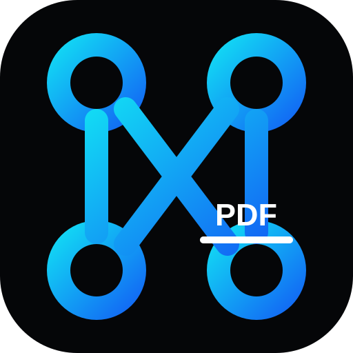

<a name="readme-top"></a>

<!-- HEADER -->
<br />
<div align="center">
  <a href="https://hexaos.fr">
    
  </a>

  <h3 align="center">HEXAOS PDF</h3>

  <p align="center">
    Suite PDF gratuite, privée et performante
    <br />
    <a href="https://hexaos.fr"><strong>Découvrir le projet »</strong></a>
    <br />
    <br />
    <a href="https://hexaos.fr">Voir la démo</a>
    ·
    <a href="https://github.com/petagoria1-bot/SimplyPDF/issues/new?template=bug_report.md">Signaler un bug</a>
    ·
    <a href="https://github.com/petagoria1-bot/SimplyPDF/issues/new?template=feature_request.md">Proposer une fonctionnalité</a>
  </p>
</div>

<!-- BADGES -->
<div align="center">


[](LICENSE)
[](CONTRIBUTING.md)

</div>

<br />

<!-- ABOUT THE PROJECT -->

## ✨ À propos du projet

**HEXAOS PDF** is a premium, high-performance web application designed to redefine how you interact with PDFs. Built with a hyper-polished, responsive aesthetic, it offers a seamless, desktop-class experience for editing, converting, and managing documents directly in your browser.

Le traitement des documents est conçu pour s’effectuer localement dans le navigateur, afin de limiter la transmission de vos fichiers vers un serveur distant.

### 💎 Fonctionnalités principales

- **Traitement local** : les opérations PDF compatibles sont exécutées directement dans votre navigateur.
- **Interface moderne** : une expérience responsive construite avec **Tailwind CSS 4** et **Framer Motion**.
- **Suite complète d’outils** : fusion, division, compression, conversion, OCR, signature, protection et bien plus.
- **Compatible PWA** : installation possible sur les appareils compatibles.
- **Open source** : projet modifiable et extensible selon les termes de sa licence.

<p align="right">(<a href="#readme-top">retour en haut</a>)</p>

<!-- TECH STACK -->

## 🛠️ Technologies

Technologies utilisées pour fournir une expérience web moderne et réactive.

- **[Next.js 16](https://nextjs.org/)** : framework React pour le Web (App Router).
- **[TypeScript](https://www.typescriptlang.org/)** : typage statique et code maintenable.
- **[Tailwind CSS 4](https://tailwindcss.com/)** : système de design moderne et performant.
- **[Framer Motion](https://www.framer.com/motion/)** : animations fluides.
- **[WebAssembly (Wasm)](https://webassembly.org/)** : exécution de certaines opérations PDF dans le navigateur.
- **[Lucide React](https://lucide.dev/)** : icônes cohérentes et accessibles.

<p align="right">(<a href="#readme-top">retour en haut</a>)</p>

<!-- GETTING STARTED -->

## 🚀 Installation

Pour lancer HEXAOS PDF en local, suivez ces étapes.

### Prérequis

- Node.js 18+ installé sur votre machine.

### Installation locale

1. **Forkez** le dépôt.
2. **Clonez** votre fork :
    ```sh
    git clone https://github.com/petagoria1-bot/SimplyPDF.git
    cd SimplyPDF
    ```
3. **Installez les dépendances** :
    ```sh
    npm install
    # or yarn install
    ```
4. **Configurez l’environnement** :
    Renommez `.env.example` en `.env.local` (ou créez ce fichier) :
    ```sh
    NEXT_PUBLIC_BASE_URL=http://localhost:3000/pdf
    NEXT_PUBLIC_BASE_PATH=/pdf
    # Optional: Add Google Client ID for auth features
    NEXT_PUBLIC_GOOGLE_CLIENT_ID=your_client_id
    ```
5. **Lancez le serveur de développement** :
    ```sh
    npm run dev
    ```

Ouvrez [http://localhost:3000/pdf](http://localhost:3000/pdf) dans votre navigateur.

<p align="right">(<a href="#readme-top">retour en haut</a>)</p>

<!-- CONTRIBUTING -->

## 🤝 Contribuer

**Les contributions sont les bienvenues !** ❤️

HEXAOS PDF est un projet open source. Les corrections, améliorations de documentation et nouvelles fonctionnalités sont les bienvenues.

### Comment contribuer

1.  Consultez notre **[guide de contribution](CONTRIBUTING.md)**.
2.  Consultez la **[roadmap](ROADMAP.md)** pour connaître les évolutions prévues.
3.  Choisissez une issue ou proposez une nouvelle fonctionnalité.
4.  Forkez le dépôt et créez votre branche (`git checkout -b feat/MaFonctionnalite`).
5.  Commitez vos modifications.
6.  Push to the branch (`git push origin feat/AmazingFeature`).
7.  Ouvrez une **Pull Request**.

> **Note :** la documentation fait partie intégrante du projet. N’hésitez pas à corriger les erreurs ou à proposer des améliorations.

<p align="right">(<a href="#readme-top">retour en haut</a>)</p>

<!-- DOCUMENTATION -->

## 📚 Documentation

Les principaux documents du projet sont disponibles dans le dépôt.

- 📖 **[Contributing Guide](CONTRIBUTING.md)** - Installation et contribution au projet.
- ⚖️ **[Code of Conduct](CODE_OF_CONDUCT.md)** - Règles de conduite du projet.
- 📝 **[Changelog](CHANGELOG.md)** - Historique des modifications.
- 🗺️ **[Roadmap](ROADMAP.md)** - Évolutions prévues du projet.
- 🛡️ **[Security Policy](SECURITY.md)** - Signalement des vulnérabilités.
- 🆘 **[Support](SUPPORT.md)** - Obtenir de l’aide.

<p align="right">(<a href="#readme-top">retour en haut</a>)</p>

---

## ☕ Soutenir le projet

HEXAOS PDF est un projet libre et gratuit. Vos contributions et retours sont les bienvenus.

## 📱 Site HEXAOS

[Site HEXAOS](https://hexaos.fr)

---

<p align="center">
  Créé avec ❤️ par <strong>HEXAOS</strong>
</p>
